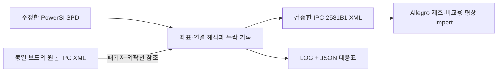

# BRD-SPD-IPC2581

**PowerSI SPD를 IPC-2581 Revision B Amendment 1 XML로 변환하는 Windows 프로그램입니다.**
Plane과 void, 배선, via, pad, 부품 배치와 pin/net 연결을 읽고, 변환 한계와 누락을 `.log` 및 `.report.json`으로 남깁니다. GUI와 CLI를 제공합니다.

> **이 프로그램은 원본 Allegro BRD를 완전히 재구성하는 도구가 아닙니다.**
> Allegro 24.1의 `ipc2581_in -x -g`는 stackup과 제조/비교용 layer features를 가져옵니다. 기존 BRD의 native cline, 부품, net, dynamic plane/repour 규칙을 자동 갱신하지 않습니다. 따라서 XML 생성 성공, XSD 검증 성공, 원본 설계 반영 완료는 서로 다릅니다.

## 설치와 실행

1. [Releases](https://github.com/yunhyok/BRD-SPD-IPC2581/releases)에서 `BRD-SPD-IPC2581-Setup-0.1.0.exe`를 설치합니다. 관리자 권한과 별도 Python 설치가 필요하지 않습니다.
2. 시작 메뉴의 **BRD-SPD-IPC2581**에서 SPD와 새 출력 XML 경로를 선택합니다. 동일 보드에서 추출한 IPC XML이 있으면 참조 파일로 지정합니다.
3. 변환 후 XML 옆의 `.log`와 `.report.json`을 확인합니다. 기본 제공 공식 XSD 검증을 통과한 XML만 최종 경로에 게시합니다.

설치파일은 코드 서명이 없는 초기 릴리스입니다. 설치 경로는 기본적으로 `%LOCALAPPDATA%\Programs\BRD-SPD-IPC2581`입니다.

## 변환 경로



참조 XML의 동박/배선 형상을 복사하지 않습니다. 물리 형상은 SPD에서 생성합니다. 참조 XML의 BOM은 변경 전 정보일 수 있으므로 복사하지 않고 로그에 기록합니다. 참조 XML이 없거나 외곽선이 비어 있으면 보드 크기를 추측하지 않습니다.

## CLI

설치된 `brd-spd-ipc2581-cli.exe`를 사용하거나 소스에서 다음 명령을 실행합니다.

```powershell
python -m pip install -r requirements.txt
python launch_cli.py convert edited.spd -o result.xml --template original.xml
python launch_cli.py inspect edited.spd -o inventory.json
python launch_cli.py validate result.xml --xsd schemas/IPC-2581B1.xsd
```

변환은 항상 **새 출력 파일**을 요구합니다. 입력 파일이나 기존 결과를 덮어쓰지 않습니다. 실패하면 종료 코드 `1`과 실패 보고서를 남깁니다. 경고가 있는 정상 변환은 종료 코드 `0`, 보고서 상태 `completed_with_warnings`입니다.

라이선스가 있는 Allegro의 제조/비교용 import를 실행하려면:

```powershell
python launch_cli.py import-brd result.xml -o comparison.brd --base-brd original.brd --cadence-root "C:\Cadence\SPB_24.1"
```

이 명령은 원본 대신 새 BRD를 출력합니다. Cadence 설치/라이선스는 포함하지 않습니다. **원본 ETCH plane이나 decap 부품의 자동 수정 기능으로 사용하면 안 됩니다.** OptimizePI의 `Back Annotate DeCaps`는 별도의 Cadence 보고서 기반 작업이며, 임의의 SPD 역변환이 아닙니다.

## 지원 범위와 검증

[지원 범위·손실 코드·검증 방법](docs/SUPPORT.md)을 확인하세요. 특히 `SIGNED_VOID_FALLBACK`, `INVALID_PLANE_TOPOLOGY`, `TRACE_ATTRIBUTES_NOT_EXPORTED`, `VIA_DRILL_APPROXIMATION`은 물리 설계 검토가 필요한 항목입니다.

대용량 파일은 SQLite와 layer별 임시 파일로 처리합니다. 입력 크기의 수 배에 해당하는 여유 디스크가 필요합니다. RAM 사용량은 가장 큰 plane/polygon 및 패키지에 영향을 받으며, 보드 전체를 DOM으로 읽지 않습니다. 속도는 형상 복잡도와 디스크에 따라 달라집니다.

개발·설치파일 빌드:

```powershell
python -m pip install -r requirements.txt pytest pyinstaller
python -m pytest -q
.\build.ps1
```

Inno Setup 6 또는 7이 필요합니다. GitHub Actions에서도 테스트와 Windows 설치파일을 빌드합니다. 실제 고객 설계 파일은 저장소·설치파일에 포함하지 않으며, 테스트는 합성 데이터만 사용합니다.

## 라이선스와 출처

프로그램 소스는 [MIT](LICENSE)입니다. 공식 IPC XSD와 의존성의 조건은 [THIRD_PARTY.md](THIRD_PARTY.md)에 별도로 표시합니다. 프로그램은 Cadence 또는 IPC의 인증 제품이 아닙니다.
